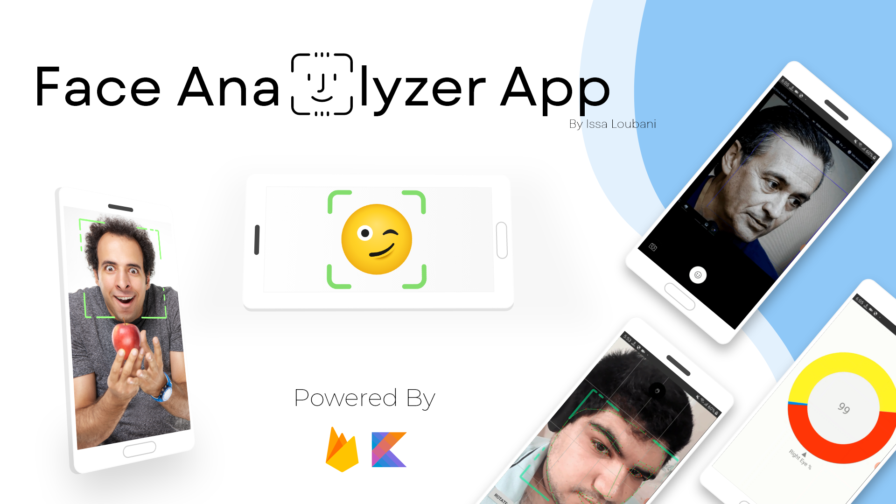

# Face Analyzer App




## About

Face analyzer app capable of facial recognition and displaying facial features (eyes open percentage, mouth, nose, etc...) powered by firebase ML and coded by Kotlin for android.

## Demo


## Features

The app currently support:

- [x] Displaying Bounding box for faces
- [x] Realtime image with facial recognition (slow)
- [x] Displaying Facial Features
- [x] Displaying Facial Features information (eyes open %, etc...)
- [x] Displaying emotional status of the detected face

## Motivation

I built this app to know more about the real-life application of machine learning and AI. As well as trying to implement and learn more about firebase ML package.

## Future Updates

- [ ] Make real-time recognition faster
- [ ] Upgrading the facial scanning with better UI and animation
- [ ] Hunting down more bugs if needed 🐱‍👤

## Installation

Clone the repo to android studio:

```git
git clone https://github.com/IssaLoubani99/Face-Analyzer-App.git
```

### Made with ❤ by Issa Loubani
